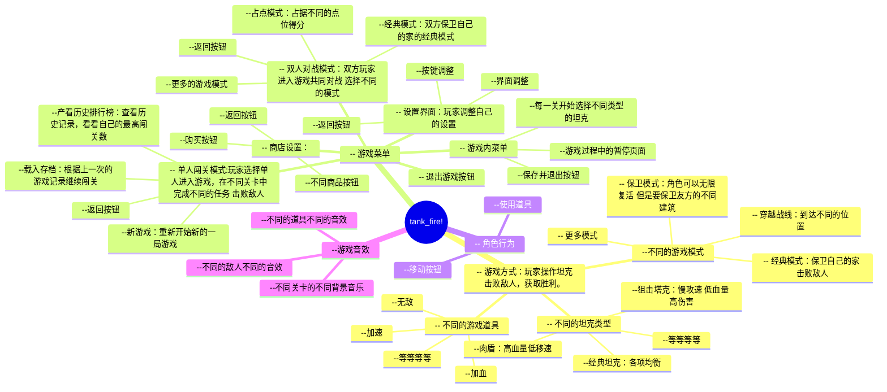

# tank_fire

```mermaid
mindmap
  root((tank_fire!))
    -- 游戏方式：玩家操作坦克击败敌人，获取胜利。
        --不同的游戏模式
            -- 经典模式：保卫自己的家 击败敌人
            -- 穿越战线：到达不同的位置
            -- 保卫模式：角色可以无限复活 但是要保卫友方的不同建筑
            -- 更多模式
        -- 不同的游戏道具
            --加速
            --加血
            --无敌
            --等等等等
        -- 不同的坦克类型
            --经典坦克：各项均衡
            --狙击塔克：慢攻速 低血量 高伤害
            --肉盾：高血量低移速
            --等等等等

    -- 游戏菜单
        -- 单人闯关模式:玩家选择单人进入游戏，在不同关卡中完成不同的任务 击败敌人
            --新游戏：重新开始新的一局游戏   
            --载入存档：根据上一次的游戏记录继续闯关
            --产看历史排行榜：查看历史记录，看看自己的最高闯关数
            --返回按钮
        -- 双人对战模式：双方玩家进入游戏共同对战 选择不同的模式
            --经典模式：双方保卫自己的家的经典模式
            --占点模式：占据不同的点位得分
            --更多的游戏模式
            --返回按钮
        -- 商店设置：
            --不同商品按钮
            --购买按钮
            --返回按钮
        -- 设置界面：玩家调整自己的设置
            --按键调整
            --界面调整
            --返回按钮
        -- 退出游戏按钮
        -- 游戏内菜单
            --游戏过程中的暂停页面
            --保存并退出按钮
            --每一关开始选择不同类型的坦克

    -- 角色行为
        --移动按钮
        --使用道具
    --游戏音效
        --不同关卡的不同背景音乐
        --不同的道具不同的音效
        --不同的敌人不同的音效
```

## 游戏简介 
- 游戏类型：平面射击
- 平台：PC端
- 游戏特点：还原坦克交战的，

## 关卡模式
- [ ] [经典模式](.requirement\经典模式.md)

墙壁类型
坦克类型
道具类型
