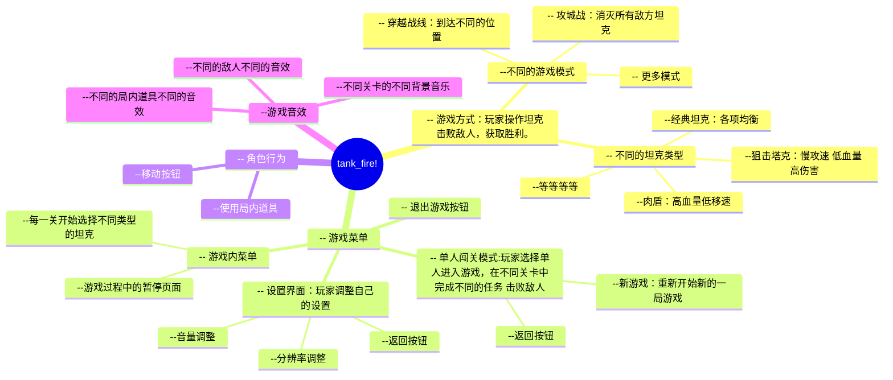

# tank_fire

### 菜单

- [tank\_fire](#tank_fire)
    - [菜单](#菜单)
    - [游戏简介](#游戏简介)
    - [玩家行为](#玩家行为)
    - [游戏对象测试](#游戏对象测试)
    - [不同类型的坦克](#不同类型的坦克)
    - [关卡模式](#关卡模式)
    - [开发流程](#开发流程)
    - [小组成员](#小组成员)

### 游戏简介 
- 游戏名：战火纷飞
- 游戏类型：平面射击
- 平台：PC端
- 游戏玩法：在游戏中，玩家的主要目标是驾驶坦克击败敌方坦克并保护自己的基地。玩家需要通过精湛的操作和战术安排来赢得每一场战斗，最终成为战场上的王者。
- 游戏特色：
  1. 丰富的坦克类型：每种坦克都有不同的速度、装甲和火力，可以满足你对坦克游戏的想象；
  2. 多样化的战场地图：从荒野、城市到冰雪世界，每一张地图都有独特的地形和挑战。
  3. 老树发新芽，原有的基础上做3D建模
  4. 采用闯关的大框架，引入了“穿越战场”、“攻城战”等新模式，同时也兼容经典模式，有效实现新旧交相辉映
  5. 全新的界面美工和UI设计，全面提升原有的像素级画质，增加特效，增强玩家体验感。

### 玩家行为

- WSAD 控制玩家坦克的前后移动 
- [ ] 移动灵敏度测试
- 鼠标 控制坦克射击的方向
- [ ] 测试坦克设计角度
- [ ] 测试坦克转向速度
- [ ] 测试是否会出现穿模，穿墙射击等情况
- 鼠标左键 坦克射击
    - 方向测试

### 游戏对象测试

- [ ] 坦克对象
    - 射击点位判断（子弹从什么位置产生，对坦克会有什么影响？）
    - 阻挡墙体，膨胀其他坦克移动测试（防止错位 穿模）
- [ ] 敌方坦克基本逻辑实现
    - 攻击坦克
    - 移动方向
    - 攻击方向
- [ ] 子弹逻辑
    - 区分双方子弹
    - 双方子弹碰撞消失
    - 不同墙体碰撞效果不同
    - 不同的子弹类型？、对应不同的效果、特效、音效

### 不同类型的坦克

[坦克汇总](./设计方案/坦克/坦克汇总.md) <-- 点这里

- [ ] 经典坦克
- [ ] 狙击坦克
- [ ] 迅捷坦克
- [ ] 肉盾坦克
- [ ] 空袭坦克
### 关卡模式

- [ ] [穿越战场](./设计方案/模式/穿越战场.md)
- [ ] [抢占险区](./设计方案/模式/抢占险区.md)
- [ ] [攻城战](./设计方案/模式/攻城战.md)

### 开发流程

## 小组成员

|小组成员|职务|用户名|
|--|--|--|
|胡豪宇|项目经理|bjhh2005|
|王卓|开发经理|Calmer2024|
|张瑞欣|产品经理|Zhanng|
|杨文韬|小组成员|ywtshuai
|陈辅炫|小组成员|ich-liebe-dich-Elysia|
