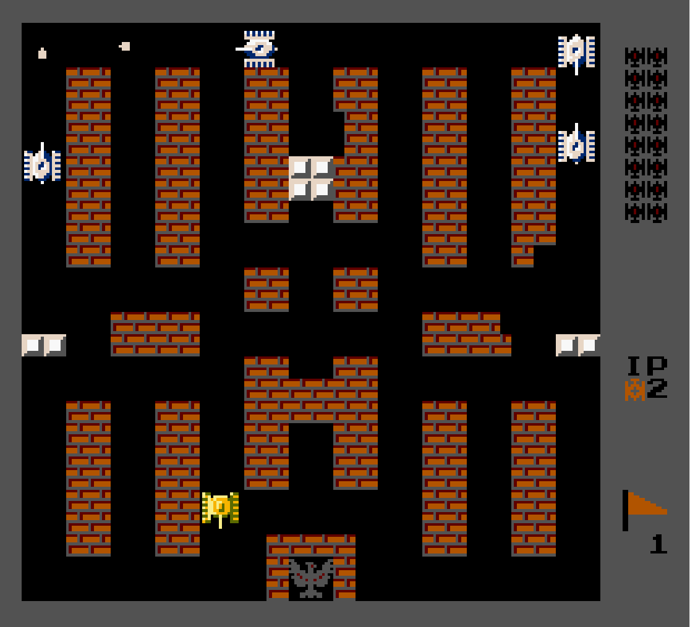

# 经典模式

## 规则
- 在保护基地和保护自己的情况下，杀死所有敌方坦克，取得胜利。
- 上图右侧从上到下依次为，要杀死的坦克的数量、生命、基地。
- 杀死对方坦克以后，会在敌方的随机地区复活。
- 玩家角色被杀死以后，会在基地附近复活。
- 在游戏期间场地之间会生成随机的道具。

**注意点**
- 敌方坦克产生之前需要警示信息 
- 玩家角色死亡后复活存在一定的无敌时间时间

**界面**

- 经典界面

**道具**

- 所有道具

