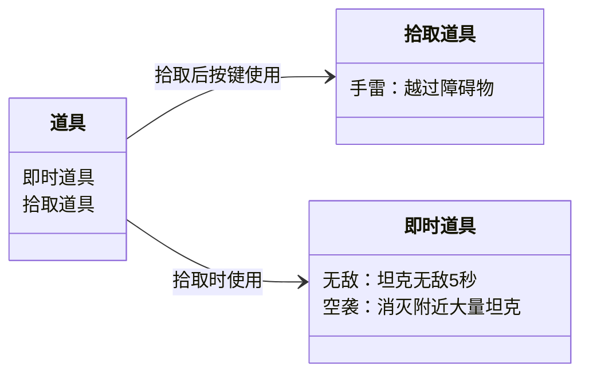

## 道具汇总

道具从使用方法上分为两大类，即时道具和拾取道具，拾取道具可以暂时储存在坦克上，即时道具。

```mermaid
classDiagram
    direction LR
    class 道具 {
        即时道具
        拾取道具
    }
    class 拾取道具 {
        手雷：越过障碍物

    }

    class 即时道具 {
        无敌：坦克无敌5秒
        空袭：消灭附近大量坦克
    }

    道具-->  拾取道具 : 拾取后按键使用
    道具 --> 即时道具 : 拾取时使用

```