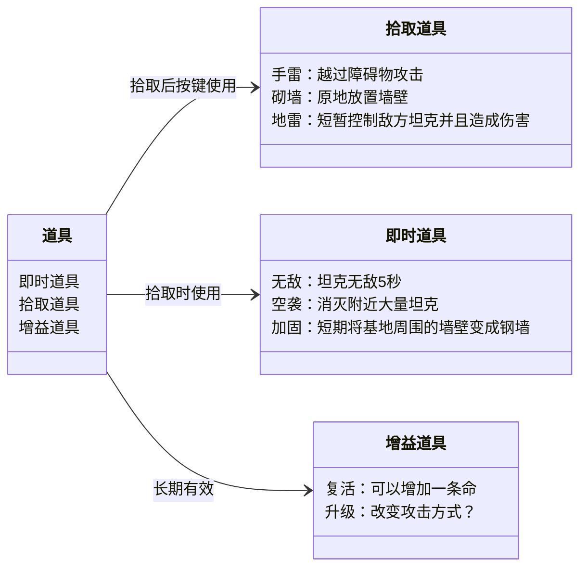

## 道具汇总

道具从使用方法上分为三大类，即时道具，拾取道具和增益道具。拾取道具就是拾取道具可以暂时储存在坦克上，等到需要时再使用。即时道具拾取时就直接使用。增益道具拾取以后可以长期有效

```mermaid
classDiagram
    direction LR
    class 道具 {
        即时道具
        拾取道具
        增益道具
    }
    class 拾取道具 {
        手雷：越过障碍物攻击
        砌墙：原地放置墙壁
        地雷：短暂控制敌方坦克并且造成伤害
        
    }

    class 即时道具 {
        无敌：坦克无敌5秒
        空袭：消灭附近大量坦克
        加固：短期将基地周围的墙壁变成钢墙
    }

    class 增益道具{
        复活：可以增加一条命
        升级：改变攻击方式？
    }
    道具-->  拾取道具 : 拾取后按键使用
    道具 --> 即时道具 : 拾取时使用
    道具 --> 增益道具 : 长期有效
```